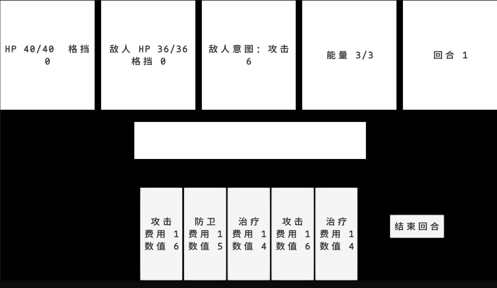

# CardRPGFramework

使用 Unity 与 C# 开发的**简化版《杀戮尖塔》求职 Demo**，重点展示数据驱动、战斗规则与客户端工程化能力，不追求商业级内容量。

## 当前阶段

Phase 1 已完成：可以在 `TestScene` 的 Play 模式里从战斗开始一路操作到胜利或失败，Core 战斗规则、ScriptableObject 配置、Unity 表现层全部接通。下一步是规划 Phase 2（地图、奖励、Buff/Rule/Effect 等系统）。

**已完成**

- `BattlePhase`：战斗阶段枚举（`NotStarted` / `PlayerTurn` / `EnemyTurn` / `Victory` / `Defeat`）。
- `CombatantState`：生命值、格挡、治疗与边界。
- `CardType` / `CardDefinition`：攻击、防御、治疗三种不可变卡牌定义。
- `CardPile`：抽牌堆、手牌、弃牌堆；抽空重洗；两堆皆空时安全停止。
- `BattleSetup` / `BattleSession`：战斗初始化、玩家回合循环（清格挡、恢复能量、抽牌）、卡牌使用校验与能量消耗、攻击/防御/治疗结算、结束回合与敌人固定攻击、胜负判定与结束后拒绝操作。
- `CardData` / `BattleConfig`：ScriptableObject 配置，转换为 `CardDefinition`/`BattleSetup`，带启动期校验（空引用、非法数值、空 ID、重复 ID）。
- `BattleController`：场景里显式引用 `BattleConfig`，创建并持有 `BattleSession`，转发使用手牌/结束回合命令，暴露只读战斗状态。
- `BattleView` / `CardButtonView` / `EndScreenView`：最小战斗 UI，显示双方状态、能量、回合、敌人意图、手牌与最近操作结果，胜利/失败时显示遮罩并阻止继续操作。
- EditMode 测试覆盖伤害/格挡/治疗边界、抽牌/弃牌/重洗与固定种子洗牌、`BattleSession` 的合法流程与关键拒绝路径，以及抽牌堆耗尽后经过完整战斗流程仍能正确重洗弃牌堆。

**本阶段范围外（记录为 Phase 2 候选，未实现）**

- Effect / Buff / Rule / Attribute / Event 等独立框架。
- 独立行动队列、多敌人、目标选择、可配置的敌人意图/AI。
- 卡牌升级、稀有度、多段效果、装备、关卡、奖励、存档与战斗回放。
- 正式美术、动画、音效。

## 文档

- 开发计划：[`Docs/MVP计划与迭代计划.MD`](Docs/MVP计划与迭代计划.MD)
- 游戏设计：[`Docs/Phase1-游戏设计.md`](Docs/Phase1-游戏设计.md)
- 技术设计：[`Docs/Phase1-技术设计.md`](Docs/Phase1-技术设计.md)
- 当前任务：[`Docs/Phase1-TODO.md`](Docs/Phase1-TODO.md)
- 架构思路：[`Docs/设计思路.MD`](Docs/设计思路.MD)
- 杀戮尖塔机制研究（Phase 2+ 设计输入）：[`Docs/杀戮尖塔机制研究.md`](Docs/杀戮尖塔机制研究.md)
- AI 协作分工：[`Docs/AI协作分工.md`](Docs/AI协作分工.md)

## 开发工作流

个人开发阶段采用简单的 trunk-based 工作流，只维护 `main` 分支并保持小步提交；暂不创建 `dev` 分支。

## 运行方式

1. 使用 Unity Hub 安装 `ProjectSettings/ProjectVersion.txt` 中指定的版本（当前为 **Unity 6000.5.9f1**）。
2. 在 Unity Hub 中打开本项目根目录。
3. 打开 `Assets/Scenes/TestScene.unity`。
4. 点击 Play 运行场景：可以看到玩家/敌人生命与格挡、能量、回合数、敌人固定攻击意图；点击手牌使用卡牌，点击“结束回合”推进战斗；胜利或失败时会显示对应遮罩并禁止继续操作。

## 运行测试

1. 打开 Unity 菜单 `Window` → `General` → `Test Runner`。
2. 切换到 **EditMode** 页签。
3. 点击 **Run All**。`CombatantStateTests`、`CardPileTests` 与 `BattleSessionTests` 应全部通过（共 29 项）。

## 目录说明

- `Assets/Scripts/Runtime/`：C# 代码，`Runtime.asmdef` 单一程序集（引用 `Unity.TextMeshPro`、`UnityEngine.UI`），按依赖方向分四层：
  - `Core/`：纯 C# 战斗规则（`Battle`/`Combatants`/`Cards`），不引用 `UnityEngine`。
  - `Data/`：`CardData`/`BattleConfig` 等 ScriptableObject 配置定义。
  - `Controllers/`：`BattleController`，Unity 适配与组装，持有 `BattleSession`。
  - `Views/`：`BattleView`/`CardButtonView`/`EndScreenView`，纯显示与输入捕获，不直接调用 `Core`/`Data`。
- `Assets/Scripts/Tests/EditMode/`：`Core` 的 EditMode 单元测试（`Tests.asmdef`）。Controllers/Views 是薄封装/展示层，按技术设计文档的测试策略不做单元测试，靠 Play 模式手动验收。
- `Assets/Data/Cards/`、`Assets/Data/Battles/`：运行时 ScriptableObject 配置资产（攻击/防御/治疗卡牌，`Default` 战斗配置）。
- `Assets/Scenes/`：Unity 场景，`TestScene` 内含 Canvas 战斗界面与 `BattleController`。
- `Docs/`：设计文档、开发计划与阶段任务。
- `Packages/`：Unity Package Manager 依赖清单。
- `ProjectSettings/`：Unity 工程设置。

## 已知限制与 Phase 2 输入

- **中文字体**：TMP 默认字体 `LiberationSans SDF` 不含中文字形，目前是否已配置 Fallback 字体资产取决于本地环境；如果界面显示中文方块/警告，按 `Window → TextMeshPro → Font Asset Creator` 生成一个中文字体资产并加入 Fallback 列表（详见开发过程记录，未固化为文档）。
- **`ResolveCard` 结算顺序**：`BattleSession.TryPlayCard` 里，效果结算发生在卡牌移入弃牌堆之前。Phase 1 的三种效果都不修改手牌/牌堆，顺序目前没有影响；以后出现"打出时触发抽牌"等会改变手牌的效果时，需要重新核对 `handIndex` 在结算时刻的语义（另见 `Docs/Phase1-技术设计.md` 第 7 节）。
- **`EnemyTurn` 是瞬时阶段**：敌人行动当前同步执行，没有独立 AI 或动画等待，`EnemyTurn` 存在时间极短、外部几乎观察不到。保留这个阶段值是为了状态机语义完整，Phase 2 接入敌人意图/AI 时可能需要拆分成真正的异步阶段。
- **`BattleSession` 身兼多职**：战斗生命周期、回合、能量、卡牌流转、效果结算、敌人行动目前都在一个类里。当前规模下拆分收益不明显，Phase 2 如果 `ResolveCard` 随效果种类膨胀，可以考虑抽出独立的效果结算类。
- **Controllers/Views 无自动化测试**：`BattleController`/`BattleView` 等只做转发和展示，真正的规则逻辑都在已被覆盖的 `BattleSession`；为它们搭 PlayMode 测试基建的收益暂不成比例，可靠性依赖手动 Play 模式验收。
